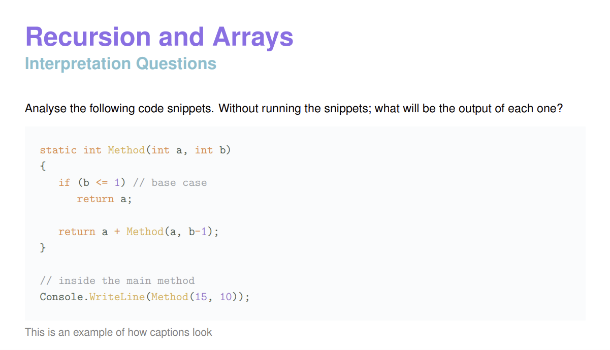

# Code Handout
A Latex template for creating beautiful programming notes and exercise sheets. Here's a glimpse of the package in action! :D



## Latex Package Installation
Copy the `code-handout.sty` to your local latex packages folder.
It's usually `C:\Users\yourusername\texmf\tex\latex` on windows and `/home/yourusername/texmf/tex/latex` on linux. You'll most probably have to create it yourself.

You can also run `kspewhich -var-value=TEXMFHOME` to find out the exact path, just remember to place the `.sty` file inside the `tex/latex` folder within the latex packages folder.

Alternatively you can run the installation script for your system.

### Windows
```
git clone https://github.com/sihlecodes/code-handout.git
cd code-handout
start install.bat
```

### Linux
```
git clone https://github.com/sihlecodes/code-handout.git
cd code-handout
./install.sh
```

## Pygments Plugin installation
To install the pygements plugin run `pip3 install .` inside the plugin directory.

```bash
git clone https://github.com/sihlecodes/code-handout.git
cd code-handout/pygments-plugin
pip3 install .
```

## Usage
Just include the code-handout package, set the title and author name and you're good to go.
The package includes a bunch of useful packages, with `minted` being one of them.

```latex
\documentclass{article}
\usepackage{code-handout}

\sethandouttitle{Insert title}
\sethandoutauthor{Insert your name or leave this blank}

% If you haven't installed the pygments-plugin uncomment the following
% \usemintedstyle{default}
% \setminted{bgcolor=Beige}

\begin{document}

\subsection*{Insert sub section title}
% ...

% \begin{minted}{csx}
% \end{minted}

\end{document}
```
The package automatically adds a `\section*` with the handout title to the document.

### Improved Lexers
The improved lexers included with the pygments plugin can be used by adding `x` to the normal aliases of a language.

```latex
% ...
\begin{minted}{csx} % <-- This is what I mean
Your code goes here :D
\end{minted}
%...
```

#### Available Improved Lexers 
Here's a list of the available lexers as well as their aliases. You can use any of the aliases for a particular language.

Language | Aliases
---|---
C# | `csx`, `csharpx`
